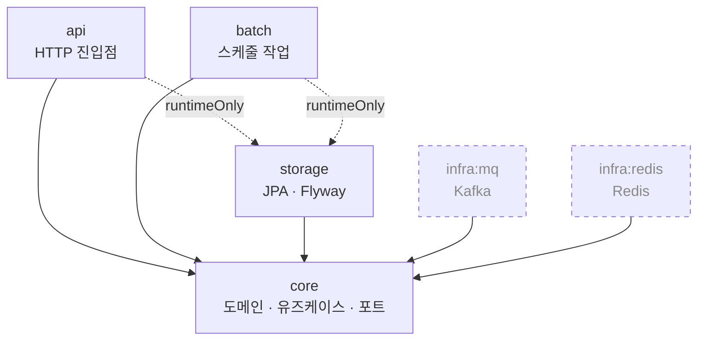

# coupon-yaho

선착순 쿠폰 발급 시스템

## 패키지 구조

### 모듈 의존 관계



실선은 `implementation`, 점선 화살표는 `runtimeOnly`, 점선 테두리는 아직 연결되지 않은 모듈이다.

| 모듈 | 역할 |
|---|---|
| `api` | HTTP 진입점. 요청/응답 변환, 전역 예외 처리 |
| `batch` | 스케줄 작업 (쿠폰 만료·정산 등) |
| `core` | 도메인 모델, 유즈케이스, 포트 인터페이스 |
| `storage` | JPA 어댑터, Flyway 마이그레이션 |
| `infra:mq` | Kafka 프로듀서·컨슈머 어댑터 |
| `infra:redis` | Redis 어댑터 (재고 카운터 등) |

`api`와 `batch`는 어댑터(`storage`, `infra:*`)를 **`runtimeOnly`로만** 의존한다.
컴파일 시점에 `JpaRepository`나 `KafkaTemplate`을 직접 참조하지 못하게 막아,
`core`가 정의한 포트 인터페이스만 사용하도록 강제하기 위함이다.

### 디렉터리

```
coupon-yaho
├── api                                  HTTP 진입점
│   └── src/main/java/com/kafkick
│       ├── ApiApplication.java          스캔·자동설정 기준 패키지라 한 단계 위에 둠
│       └── api/support/                 응답 봉투, 전역 예외 처리, requestId 필터
│
├── batch                                스케줄 작업
│   └── src/main/java/com/kafkick
│       └── BatchApplication.java
│
├── core                                 도메인 + 유즈케이스
│   └── src/main/java/com/kafkick/core
│       ├── coupon/                      도메인별 묶음
│       │   ├── domain/                  도메인 모델
│       │   ├── service/                 유즈케이스
│       │   └── port/                    어댑터가 구현할 인터페이스
│       └── support/                     TimeProvider(UTC), ErrorCode, BusinessException
│
├── storage                              JPA 어댑터
│   ├── src/main/java/com/kafkick/storage/db
│   │   ├── coupon/                      도메인별 묶음
│   │   │   ├── entity/                  JPA 엔티티
│   │   │   ├── repository/              JpaRepository + core port 구현체
│   │   │   └── mapper/                  엔티티 ↔ 도메인 모델 변환
│   │   ├── support/                     BaseEntity, UpdatableEntity
│   │   └── config/                      JPA Auditing
│   ├── src/main/resources
│   │   ├── storage.yml.example          DataSource·JPA·Flyway 공통 설정
│   │   └── db/migration/                Flyway DDL (V1__*.sql)
│   └── src/testFixtures/java/…/db       테스트 컨테이너 설정, @RepositoryTest
│
├── infra
│   ├── mq                               Kafka 어댑터
│   └── redis                            Redis 어댑터
│
└── build.gradle, settings.gradle
```

### 설정 파일

`application.yml`, `storage.yml`은 커밋하지 않는다. 클론 후 `.example`을 복사해야 앱이 뜬다.

```bash
find . -path '*/src/main/resources/*.yml.example' -exec sh -c 'cp "$1" "${1%.example}"' _ {} \;
```

DB 접속 정보는 파일에 적지 않고 `DB_HOST`·`DB_NAME`·`DB_USERNAME`·`DB_PASSWORD`
환경변수로 주입한다. `.example`의 값은 로컬 개발용 기본값이다.

### Docker 이미지

`main` 브랜치 push 또는 `v*` 태그 push 시 GitHub Actions가 API와 배치 이미지를
각각 빌드해 하나의 Docker Hub 저장소에 태그를 구분하여 올린다. 수동 실행도 가능하다.

- 주소: `https://hub.docker.com/r/${DOCKERHUB_USERNAME}/coupon-yaho`
- API 이미지: `${DOCKERHUB_USERNAME}/coupon-yaho:api-latest`
- 배치 이미지: `${DOCKERHUB_USERNAME}/coupon-yaho:batch-latest`

GitHub 저장소의 **Settings → Secrets and variables → Actions**에 아래 값을 등록한다.

- Variable `DOCKERHUB_USERNAME`: Docker Hub 사용자명 또는 조직명
- Secret `DOCKERHUB_TOKEN`: Docker Hub의 read/write 권한 Personal access token

Docker Hub에는 `coupon-yaho` 저장소를 한 번 생성해야 한다.

로컬 빌드는 다음과 같다.

```bash
docker build --build-arg APP_MODULE=api -t coupon-yaho-api .
docker build --build-arg APP_MODULE=batch -t coupon-yaho-batch .
```

테스트는 Testcontainers 로 실제 MySQL 을 띄우므로 Docker 가 필요하다.

### 새 코드를 어디에 둘 것인가

쿠폰 발급 기능을 예로 들면:

```
core/coupon/
    domain/     CouponRound, Issuance        발급 쿠폰 도메인 모델
    service/    CouponIssueService           유즈케이스
    port/       IssuanceRepository           인터페이스만. 구현은 어댑터가

core/coupontemplate/
    domain/     CouponTemplate               쿠폰 템플릿 도메인 모델
    service/    CouponTemplateCreateService  템플릿 유즈케이스
    port/       CouponTemplateRepository     템플릿 저장 인터페이스

storage/db/coupon/
    entity/     IssuanceEntity
    repository/ IssuanceJpaRepository
                IssuanceRepositoryImpl       core 의 port 구현
    mapper/     IssuanceEntityMapper         엔티티 ↔ 도메인 모델 변환

storage/db/coupontemplate/
    entity/     CouponTemplateEntity
    repository/ CouponTemplateJpaRepository
                CouponTemplateRepositoryImpl core 의 port 구현
    mapper/     CouponTemplateEntityMapper   엔티티 ↔ 도메인 모델 변환

infra/mq/coupon/
    CouponEventPublisher                     core 의 port 구현

api/coupon/
    controller/  CouponController
    dto/request/ CouponUseRequest
    dto/response/CouponIssueResponse

api/coupontemplate/
    controller/  CouponTemplateController
    dto/request/ CouponTemplateCreateRequest
    dto/response/CouponTemplateDetailResponse
```

각 모듈의 `support/` 패키지는 그 모듈 안의 횡단 관심사를 담는다.

