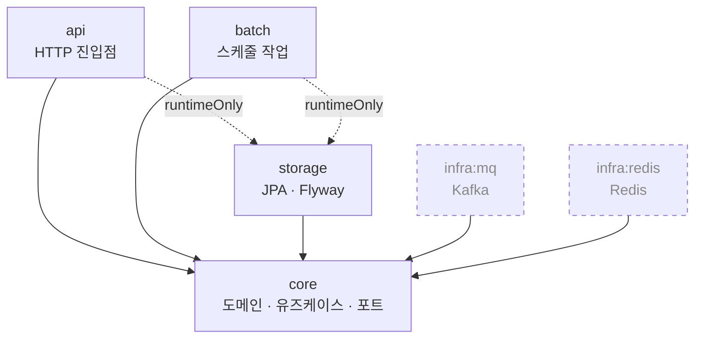

# coupon-yaho

선착순 쿠폰 발급 시스템

## 패키지 구조

### 모듈 의존 관계



실선은 `implementation`, 점선 화살표는 `runtimeOnly`, 점선 테두리는 아직 연결되지 않은 모듈이다.

| 모듈 | 역할 |
|---|---|
| `api` | HTTP 진입점. 요청/응답 변환, 전역 예외 처리 |
| `batch` | 스케줄 작업 (쿠폰 만료 등) + 검증 배치. 관리용 HTTP 트리거를 연다 — **공유 비밀 토큰 관문(기본 켬), 기본 비노출** |
| `core` | 도메인 모델, 유즈케이스, 포트 인터페이스 |
| `storage` | JPA 어댑터, Flyway 마이그레이션 |
| `infra:mq` | Kafka 프로듀서·컨슈머 어댑터 |
| `infra:redis` | Redis 어댑터 (재고 카운터 등) |

`api`와 `batch`는 어댑터(`storage`, `infra:*`)를 **`runtimeOnly`로만** 의존한다.
컴파일 시점에 `JpaRepository`나 `KafkaTemplate`을 직접 참조하지 못하게 막아,
`core`가 정의한 포트 인터페이스만 사용하도록 강제하기 위함이다.

### 디렉터리

```
coupon-yaho
├── api                                  HTTP 진입점
│   └── src/main/java/com/kafkick
│       ├── ApiApplication.java          스캔·자동설정 기준 패키지라 한 단계 위에 둠
│       └── api/support/                 응답 봉투, 전역 예외 처리, requestId 필터
│
├── batch                                스케줄 작업 + 검증 배치
│   └── src/main/java/com/kafkick
│       ├── BatchApplication.java
│       └── batch/
│           ├── api/                     admin API — verify 트리거·조회, expire·cleanup 복구,
│           │                             실행 이력 조회 (docs/15)
│           ├── config/                  기동 가드, 지표, 전용 실행기, 시각 축 변환
│           ├── job/                     Spring Batch 잡 정의
│           ├── replay/                  이력 리플레이
│           └── schedule/                @Scheduled 진입점
│
├── core                                 도메인 + 유즈케이스
│   └── src/main/java/com/kafkick/core
│       ├── coupon/                      도메인별 묶음
│       │   ├── domain/                  도메인 모델
│       │   ├── service/                 유즈케이스
│       │   └── port/                    어댑터가 구현할 인터페이스
│       ├── batch/                       배치 실행 이력 포트 — 세 잡이 공유하므로 평면
│       ├── expiration/                  만료 포트 + 청크 값 객체 — 평면
│       ├── verification/                검증 포트 + 도메인 enum — 평면
│       └── support/                     TimeProvider(UTC), ErrorCode, BusinessException
│
├── storage                              DB 어댑터
│   ├── src/main/java/com/kafkick/storage/db
│   │   ├── coupon/                      JPA 도메인 — 엔티티가 있으므로 셋으로 가른다
│   │   │   ├── entity/                  JPA 엔티티
│   │   │   ├── repository/              JpaRepository + core port 구현체
│   │   │   └── mapper/                  엔티티 ↔ 도메인 모델 변환
│   │   ├── batch/                       배치 메타(BATCH_JOB_EXECUTION) 조회 어댑터 — 평면
│   │   ├── verification/                검증 JDBC 어댑터 — 평면
│   │   ├── expiration/                  만료 JDBC 어댑터 — 평면
│   │   ├── support/                     BaseEntity, UpdatableEntity
│   │   └── config/                      JPA Auditing
│   ├── src/main/resources
│   │   ├── storage.yml.example          DataSource·JPA·Flyway 공통 설정
│   │   └── db/migration/                Flyway DDL — 기준 둘(V1 · V11) + V<YYYYMMDD><NN>__*.sql
│   └── src/testFixtures/java/…/db       테스트 컨테이너 설정, @RepositoryTest
│
│   ※ entity/repository/mapper 3분할은 JPA 도메인만이다. 검증·만료는 300만~534만 행을
│     집계 SQL 로 훑느라 JPA 를 안 쓰기로 했고(엔티티도 매퍼도 없다) 평면으로 둔다.
│
├── infra
│   ├── mq                               Kafka 어댑터 (토픽·프로듀서 설정 계층)
│   └── redis                            Redis 어댑터
│
└── build.gradle, settings.gradle
```

### 설정 파일

`application.yml`, `storage.yml`, `redis.yml`, `kafka.yml` 등 실행용 설정은 커밋하지 않는다.
`spring.config.import`는 optional이 아니라서 파일 하나가 없으면 기동이 중단된다
(`redis.yml`·`kafka.yml`이 그렇다).

**Gradle 빌드·테스트는 이 복사를 알아서 한다.** 루트 `build.gradle`의 `processResources`가
빌드 산출물에서 빠진 이름을 `.example`로 채운다 — 신규 클론에서 `./gradlew build`가 아무 수동
단계 없이 통과한다. 소스 트리에는 쓰지 않으므로, 각자 만든 실제 파일이 있으면 그쪽이 이긴다.

앱을 Gradle 밖에서 띄우거나(IDE가 Gradle에 위임하지 않는 설정) 파일을 직접 고쳐 쓰려면
아래로 복사한다. **설정 파일이 늘어나는 브랜치를 받은 뒤에도 다시 돌린다.**

```bash
find . -path '*/src/main/resources/*.yml.example' \
  -exec sh -c '[ -f "${1%.example}" ] || cp "$1" "${1%.example}"' _ {} \;
```

⚠️ **없을 때만 복사한다.** 예전에는 무조건 덮어써서, 브랜치를 받고 이 명령을 다시 돌리면
로컬에서 고친 DB 접속 정보나 스위치가 조용히 사라졌다. 어떤 파일을 최신 `.example` 값으로
되돌리고 싶으면 그 파일을 지우고 다시 돌린다.

⚠️ 이 복사를 빼먹어도 앱은 **죽지 않고 설정 없이 뜬다.** `application.yml`이 없으면 그 안의
`spring.config.import`가 통째로 안 돌아서, 나머지 파일이 없다는 사실조차 드러나지 않는다.
그 상태의 증상은 조건부 빈이 사라지는 것뿐이라 원인을 찾기 어렵다 — 위 자동 복사를 둔 이유다.

⚠️ **위 명령은 모듈 리소스만 채운다.** compose 로 띄울 때 필요한 저장소 루트의 두 파일은
따로 복사해야 한다 — `compose.yml`이 `./application.yml`을 컨테이너에 bind mount 하고
`.env`를 `env_file`로 읽는다. 둘 다 gitignore 대상이라 신규 클론에는 없다.

```bash
[ -f .env ] || cp .env.example .env
[ -f application.yml ] || cp application.yml.example application.yml
```

빼먹고 `docker compose up` 하면 Docker가 `application.yml`이라는 **디렉터리**를 만들어
마운트한다(실측). 설정이 통째로 비는데 에러에는 그 원인이 안 나온다.

⚠️ 위 조건이 `-e`가 아니라 **`-f`**인 이유가 그것이다. `-e`는 그렇게 생긴 디렉터리도
"있다"로 판정해 복사를 건너뛴다 — 한 번 이 상태에 빠지면 명령을 다시 돌려도 낫지 않는다.
디렉터리가 생겼으면 먼저 지운다.

```bash
[ -d application.yml ] && rmdir application.yml
```

DB 접속 정보는 파일에 적지 않고 `DB_HOST`·`DB_NAME`·`DB_USERNAME`·`DB_PASSWORD`
환경변수로 주입한다. `.example`의 값은 로컬 개발용 기본값이다.

### API 모니터링

API Actuator는 애플리케이션 포트와 분리된 관리 포트(기본 `9090`)에서만 노출한다.
노출 엔드포인트는 `health`, `metrics`, `prometheus`이며 `env`, `configprops`,
`beans`, `heapdump`는 명시적으로 차단한다.

```bash
curl http://localhost:9090/actuator/health
curl http://localhost:9090/actuator/metrics/app.issuance.outcome
curl http://localhost:9090/actuator/metrics/coupon.issue.operation.duration
curl http://localhost:9090/actuator/metrics/hikaricp.connections.active
curl http://localhost:9090/actuator/metrics/http.server.requests
```

쿠폰 발급 시작·종료 과정 로그는 `COUPON_ISSUE_LOG_LEVEL=TRACE`일 때만 출력한다.
부하 테스트에서는 로그 I/O가 측정값을 오염시키지 않도록 기본값 `INFO`를 유지한다.
커스텀 `operation` 지표는 서버 내부 유즈케이스 시간을 뜻하며, 최종 성능 판정 기준은
Locust가 클라이언트 응답 수신 시점에 측정한 값이다.

API와 배치는 포트가 겹치지 않는다 — API 는 업무 `8080`·관리 `9090`, 배치는 업무 `9091`·관리 `9092` 다.
(한때 배치 업무 포트가 `9090` 이라 API 관리 포트와 부딪혔고, 그때는
`MANAGEMENT_SERVER_PORT=19090` 으로 피했다. CY-213 이 배치를 `9091` 로 옮겨 그 회피가 필요 없어졌다.)

### Docker 이미지

`main` 브랜치 push 또는 `v*` 태그 push 시 GitHub Actions가 API와 배치 이미지를
각각 빌드해 하나의 Docker Hub 저장소에 태그를 구분하여 올린다. 수동 실행도 가능하다.

- 주소: `https://hub.docker.com/r/${DOCKERHUB_USERNAME}/coupon-yaho`
- API 이미지: `${DOCKERHUB_USERNAME}/coupon-yaho:api-latest`
- 배치 이미지: `${DOCKERHUB_USERNAME}/coupon-yaho:batch-latest`

GitHub 저장소의 **Settings → Secrets and variables → Actions**에 아래 값을 등록한다.

- Variable `DOCKERHUB_USERNAME`: Docker Hub 사용자명 또는 조직명
- Secret `DOCKERHUB_TOKEN`: Docker Hub의 read/write 권한 Personal access token

Docker Hub에는 `coupon-yaho` 저장소를 한 번 생성해야 한다.

로컬 빌드는 다음과 같다.

```bash
docker build --build-arg APP_MODULE=api -t coupon-yaho-api .
docker build --build-arg APP_MODULE=batch -t coupon-yaho-batch .
```

테스트는 Testcontainers 로 실제 MySQL 을 띄우므로 Docker 가 필요하다.

### 신규 환경의 런타임 설정 초기화

`config:runtime`은 애플리케이션이 자동으로 만들지 않는다. 신규 Redis 볼륨을 준비한
환경에서는 API를 올리기 전에 Redis를 기동하고 다음 시드 작업을 명시적으로 한 번
실행한다.

```bash
docker compose up -d redis
docker compose --profile runtime-config-seed run --rm runtime-config-seed
docker compose up -d
```

시드 작업은 `SET NX`를 사용하므로 이미 존재하는 설정과 revision을 덮어쓰지 않는다.
이 절차는 **새 환경의 최초 초기화 전용**이다. 운영 중 키 유실이나 데이터 복구 상황에서
revision을 0으로 되돌리는 복구 수단으로 사용하지 않는다.

### 관측 계정 권한 재부여 (`--profile obs-grants`)

관측 전용 계정은 **양성 목록의 테이블만** 읽는다. 목록의 정본은
`infra/mysql/obs-grants/allowlist.txt` 이고, `apply.sh` 가 그것을 GRANT 로 옮긴다.

```bash
# ⚠️ api 가 한 번 떠서 Flyway 마이그레이션이 끝난 뒤에 친다
docker compose --profile obs-grants run --rm obs-grants
```

**이 순서를 지켜야 한다.** 테이블 단위 GRANT 는 그 테이블이 이미 있어야 한다.
`initdb.d` 로 옮기면 그 시점에는 테이블이 하나도 없어서 `ERROR 1146` 으로
**MySQL 컨테이너 자체가 안 뜬다** — 그래서 계정 생성(`initdb`)과 권한 부여(여기)가
따로 있는 것이다. 앞으로 되돌리고 싶어지면 `20-obs-account.sh` 맨 위 ⚠️ 를 먼저 읽을 것.

#### 안 돌리면 어떻게 되나

두 갈래이고, 증상이 정반대다.

| 상태 | 증상 |
|---|---|
| **신규 클론** (볼륨 없음) | obs 계정에 권한이 아예 없다(`USAGE` 뿐). **관측 풀이 커넥션을 못 연다** — JDBC URL 이 스키마를 지정하므로 질의가 아니라 접속에서 거부된다: `SQLException 1044 (Access denied for user 'obs'@'%' to database 'app')`. 관리자 배치 이력 화면 500, 도메인 게이지 수집 실패 로그, obs 헬스 기여자 DOWN |
| **기존 볼륨** (OBS-36 이전) | 예전 `GRANT SELECT ON app.*` 가 그대로 남아 **아무 증상이 없다.** 관측은 잘 돌고, obs 계정은 `members` 도 계속 읽는다 |

두 번째가 이 절이 존재하는 이유다. **증상이 없으므로 스스로 알아차릴 방법이 없다.**
확인은 이렇게 한다 — 아래 출력에 `` `app`.* `` 가 보이면 아직 안 돌린 것이다.

```bash
docker compose exec -T mysql sh -c \
  'MYSQL_PWD="$MYSQL_ROOT_PASSWORD" mysql -uroot -N -e "SHOW GRANTS FOR \"$DB_OBS_USERNAME\"@\"%\""'
```

재부여 뒤에는 테이블별 `GRANT SELECT ON \`app\`.\`issuances\`` 같은 줄만 남는다.

기동 시 자기 진단은 두지 않았다. 위 표의 조용한 쪽은 **일회성 이행 상태**라, 그것을
잡으려고 기동 경로에 상시 DB 왕복과 아무도 안 읽는 WARN 로그를 영구히 남기는 값이
안 맞는다고 판단했다. 대신 목록과 실제 질의가 어긋나는 회귀는
`ObservationAccountPrivilegeTest` 가 CI 에서 양방향으로 막는다.

#### 목록에 테이블을 추가할 때

읽는 코드를 **먼저** 넣는다. 그러면 `ObservationAccountPrivilegeTest` 가
"목록에 없는 테이블을 관측 풀로 읽는다" 며 깨져서 추가를 강제한다. 반대로 아무도 안 읽는
테이블을 미리 넣으면 같은 테스트의 반대 방향 단언이 깨진다 — 양성 목록이 두 번째
스키마 GRANT 로 자라는 것을 그렇게 막는다.

추가한 뒤에는 위 `run --rm obs-grants` 를 다시 돌린다. 몇 번을 돌려도 같은 결과다.

### 기존 MySQL 볼륨에 관측 계정 추가

관측 전용 계정(`DB_OBS_USERNAME`)은 compose 가 자동으로 만든다 —
`infra/mysql/initdb/20-obs-account.sh` 가 그 자리다.

**다만 `initdb.d` 는 데이터 디렉터리가 비어 있을 때만 돈다.** 이미
`coupon-mysql-data` 볼륨이 있는 환경에서는 그 파일을 고쳐도 아무 일이 일어나지 않고,
관측 조회가 첫 요청에서 `Access denied` 로 죽는다. 기존 볼륨을 쓰는 사람에게는
재현이 안 되므로 *"내 로컬은 되는데"* 가 되기 쉬운 자리다.

그때는 **초기화 스크립트를 그대로 한 번 돌린다.** SQL 을 손으로 옮겨 적지 않는다 —
그 스크립트가 식별자 검증·따옴표와 백슬래시 이스케이프·`ALTER USER`(비밀번호 회전)를
전부 갖고 있고, 손으로 적은 명령은 그것을 잃는다.

```bash
# 1) 컨테이너를 다시 만든다. 데이터 볼륨은 유지된다
docker compose up -d mysql

# 2) STATUS 가 healthy 가 될 때까지 기다린다
docker compose ps mysql

# 3) 스크립트를 한 번 돌린다
docker compose exec mysql sh /docker-entrypoint-initdb.d/20-obs-account.sh
```

⚠️ **1번을 건너뛰면 3번이 실패한다.** `docker compose exec` 는 컨테이너를 다시 만들지
않으므로, 이 변경 **이전에 만들어진 컨테이너에는 그 스크립트가 마운트돼 있지 않다.**
실제로 확인하면 이렇다.

```
$ docker compose exec -T mysql ls -l /docker-entrypoint-initdb.d/
total 0
```

`up -d` 는 데이터 볼륨(`coupon-mysql-data`)을 그대로 두고 컨테이너만 새 정의로 바꾼다.
데이터 디렉터리가 비어 있지 않으므로 `initdb.d` 는 여전히 자동 실행되지 않는다 —
그래서 3번을 손으로 돌리는 것이다.

값을 셸에 올릴 필요는 없다. `compose.yml` 의 mysql 서비스가 `env_file: .env` 로
`DB_OBS_USERNAME` · `DB_OBS_PASSWORD` · `MYSQL_*` 를 갖고 있고, 다시 만든 컨테이너가
그 값과 마운트를 함께 받는다.

> ⚠️ **`. ./.env` 로 소싱하지 말 것.** 그러면 값 안의 `$(...)` 가 호스트 셸에서 실행된다.
> 비밀번호 관리 도구가 만든 값에 그런 문자가 들어갈 수 있다.

몇 번을 돌려도 같은 결과다 — `CREATE USER IF NOT EXISTS` 뒤에 `ALTER USER` 가 붙어 있어
비밀번호도 매번 맞춰진다.

⚠️ **이 절차는 계정만 만든다. 권한은 안 준다.** [OBS-36] 이후 그 스크립트에서 `GRANT` 가
빠졌다 — 위의 **관측 계정 권한 재부여** 절을 이어서 돌려야 관측 조회가 실제로 된다.
안 돌리면 계정은 생겼는데 권한이 `USAGE` 뿐이라, 관측 접속이 `Access denied ... to database`(1044)로
계속 거부된다.

> **이 자리에 있던 "GRANT 는 스키마 단위여야 한다" 는 문단은 [OBS-36] 이 지웠다.**
> 그 문단은 테이블 단위로 열거하면 `BATCH_JOB_EXECUTION` 같은 것이 조용히 빠진다고 경고했는데,
> 지금은 `ObservationAccountPrivilegeTest` 가 **양성 목록과 실제 질의문을 양방향으로 대조**해
> 그 누락을 CI 에서 막는다. 반대로 스키마 단위 GRANT 는 `members` 노출을 되살린다.
> 초기화 경로에서 테이블 단위가 불가능한 것은 여전히 맞고(`ERROR 1146`), 그래서 부여가
> 위의 별도 절차로 나가 있다.

### 컨테이너로 띄우기

```bash
docker compose -f base.yml up                     # DB·관제만. batch 는 안 뜬다
DB_HOST=127.0.0.1 ./gradlew :api:bootRun          # ← 마이그레이션. 한 번만 (아래 참조)
docker compose -f base.yml -f batch.yml up batch  # 배치 서버를 겹쳐 올린다
```

**배치의 업무 포트는 기본으로 안 열린다.** 거기에 검증 트리거
(`POST /api/v1/admin/verify`)와 복구(`/api/v1/admin/expire/runs/**`)가 있는데, **사용자
인증이 없다** — batch 에 Spring Security 가 없고 토큰 규약은 다른 영역의 몫이라 혼자 정하면
두 벌이 된다. 그래서 **방어선이 둘**이다:

1. **포트 미노출** — 기본. 열 때만 오버레이를 얹는다.
2. **공유 비밀 헤더**(`X-Batch-Admin-Token`, CY-742) — 오버레이를 얹으면 **자동으로 켜지고**,
   `BATCH_ADMIN_TOKEN` 이 없으면 기동을 거절한다. 주장이 아니라 **소지**를 묻는 것이라
   "서명 없는 역할 클레임은 안 넣는다"(`docs/11` §11)는 결정과 다르다.

```bash
export BATCH_ADMIN_TOKEN=$(openssl rand -hex 24)
docker compose -f base.yml -f batch.yml -f batch-expose.yml up batch
```

**가운데 줄을 빼면 batch 가 기동에서 죽는다.** `base.yml` 의 mysql 은 **빈 DB** 만 만들고,
스택 어디에도 마이그레이션을 돌리는 것이 없다 — `depends_on: service_healthy` 가 보장하는
것은 `mysqladmin ping` 뿐이다. batch 는 `flyway.enabled:false` 라(마이그레이션 소유자는
`api` 하나로 고정) 스스로 만들지 않는다.

예전에는 그 상태로도 **기동이 그냥 성공**하고 첫 잡 실행에서 SQL 에러로 죽었다.
지금은 `SchemaPresenceGuard` 가 기동 시점에 막고 **무엇이 없는지와 조치를 말한다** —
`api` 를 먼저 띄우라는 것인지, 배치 메타 마이그레이션 셋만 부으면 되는지, 접속 URL 에서
DB 이름을 빠뜨린 것인지 셋을 가른다.

`api` 를 한 번 띄우는 것이 번거로우면 마이그레이션만 직접 부어도 된다. Flyway 이력이
남지 않으므로 **로컬 실험용으로만** 쓴다.

> 검증용 셋(`coupon_clean`·`coupon_corrupt`)은 cy-seed 로 만드는데 거기에는 Spring Batch
> 메타 테이블이 없다. 그 DB 를 보게 batch 를 띄우려면 `V11__batch_metadata.sql` 과 인덱스
> 둘(`V2026082513__ix_batch_job_execution_lookup.sql` · `V2026082514__ix_batch_job_execution_history.sql`)을
> 따로 부어야 한다 — 절차는 `docs/14` 시연 절차, 배경은 `docs/13` §4a.
> **인덱스도 기동 가드가 본다**(CY-686) — 빠뜨리면 `SCHEMA_NOT_MIGRATED` 로 기동을 거절한다.
> 이름뿐 아니라 선두 컬럼까지 대조한다. 급하면 `batch.schema-guard.require-batch-indexes=false` 로 끌 수 있다.

> ### ⚠️ 이 브랜치를 처음 받았다면 DB 를 비우고 시작한다
>
> 마이그레이션 **버전 번호가 전부 바뀌었다**(연번 → 날짜형). 이유는 이 계보와 `main` 이
> `V2`~`V15` 열넷을 서로 다른 뜻으로 쓰고 있었기 때문이다 — 그대로 머지되면 Flyway 가
> 같은 버전 둘을 보고 기동을 거부한다.
>
> **그래서 옛 번호로 적용된 DB 는 그대로 못 쓴다.** `flyway_schema_history` 에 남은 버전이
> 지금 파일들과 안 맞아 체크섬 검증(`validate-on-migrate: true`)에서 막히고, 통과시켜도
> 이미 있는 인덱스를 다시 만들려다 `1061 Duplicate key name` 으로 죽는다.
> `clean-disabled: true` 라 `flyway clean` 도 막혀 있다.
>
> ```bash
> docker compose -f base.yml down -v     # 볼륨까지 지운다
> docker compose -f base.yml up -d
> ./gradlew :api:bootRun                 # 새 번호로 처음부터 적용된다
> ```

**둘로 가른 것은 k6 측정 때문이다.** 부하 중에는 배치가 재고를 건드리면 안 되는데, 그 정지
수단이 설정이 아니라 컨테이너다 — `base.yml` 이 한 글자도 안 바뀌어야 부하 비교표의
*"동일 리소스 limit"* 이 유지된다(`docs/11-batch-implementation.md`).

`.example` 복사는 이미지 안에서 **다시 한 번** 일어난다(`Dockerfile`). 위 `find` 명령이 로컬
실행용이라면, 컨테이너는 자기 빌드 컨텍스트에서 같은 절차를 밟는다 — 로컬에서 만든
`application.yml` 은 `.dockerignore` 가 막아 이미지에 안 들어간다.

**포트는 전부 `127.0.0.1` 에만 묶는다.** `0.0.0.0` 으로 열면 인증이 없는 Prometheus·
Alertmanager 와 기본 비밀번호를 쓰는 MySQL 이 그대로 노출된다. 배치의 **관리 포트(9092)는
호스트로 안 내보낸다** — 관제는 컨테이너 네트워크에서 `batch:9092` 로 긁는다.

| 서비스 | 호스트 | 용도 |
|---|---|---|
| `batch` | `9091` | 업무 포트 — **기본으로 안 내보낸다.** `batch-expose.yml` 을 얹을 때만 열린다 |
| `mysql` | `3306` | |
| `prometheus` | `9490` | 규칙·타깃 확인 (`/api/v1/rules`, `/api/v1/targets`) |
| `alertmanager` | `9493` | |
| `alert-sink` | 없음 | 받은 알림을 **Slack 으로 넘긴다**(CY-651). `SLACK_WEBHOOK_URL` 이 없으면 stdout 만 하고 안 죽는다 — 그때는 `docker compose logs alert-sink` 로 본다 |

### 새 코드를 어디에 둘 것인가

쿠폰 발급 기능을 예로 들면:

```
core/coupon/
    domain/     CouponRound, Issuance        발급 쿠폰 도메인 모델
    service/    CouponIssueService           유즈케이스
    port/       IssuanceRepository           인터페이스만. 구현은 어댑터가

core/coupontemplate/
    domain/     CouponTemplate               쿠폰 템플릿 도메인 모델
    service/    CouponTemplateCreateService  템플릿 유즈케이스
    port/       CouponTemplateRepository     템플릿 저장 인터페이스

storage/db/coupon/
    entity/     IssuanceEntity
    repository/ IssuanceJpaRepository
                IssuanceRepositoryImpl       core 의 port 구현
    mapper/     IssuanceEntityMapper         엔티티 ↔ 도메인 모델 변환

storage/db/coupontemplate/
    entity/     CouponTemplateEntity
    repository/ CouponTemplateJpaRepository
                CouponTemplateRepositoryImpl core 의 port 구현
    mapper/     CouponTemplateEntityMapper   엔티티 ↔ 도메인 모델 변환

infra/mq/coupon/
    CouponEventPublisher                     core 의 port 구현

api/coupon/
    controller/  CouponController
    dto/request/ CouponUseRequest
    dto/response/CouponIssueResponse

api/coupontemplate/
    controller/  CouponTemplateController
    dto/request/ CouponTemplateCreateRequest
    dto/response/CouponTemplateDetailResponse
```

각 모듈의 `support/` 패키지는 그 모듈 안의 횡단 관심사를 담는다.
