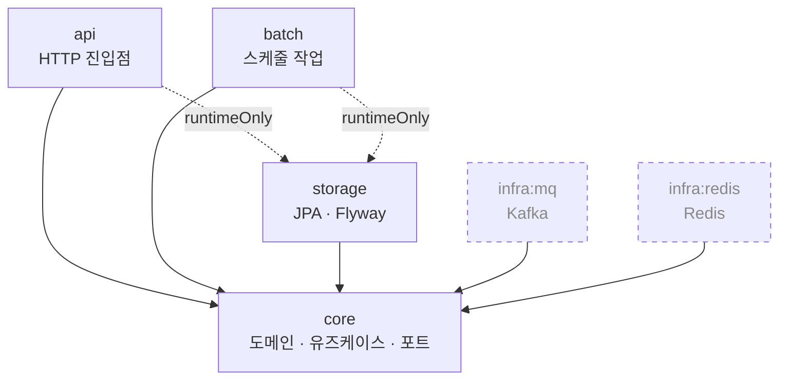

# coupon-yaho

선착순 쿠폰 발급 시스템

## 패키지 구조

### 모듈 의존 관계



실선은 `implementation`, 점선 화살표는 `runtimeOnly`, 점선 테두리는 아직 연결되지 않은 모듈이다.

| 모듈 | 역할 |
|---|---|
| `api` | HTTP 진입점. 요청/응답 변환, 전역 예외 처리 |
| `batch` | 스케줄 작업 (쿠폰 만료 등) + 검증 배치. 관리용 HTTP 트리거를 연다 — **인증 없음, 기본 비노출** |
| `core` | 도메인 모델, 유즈케이스, 포트 인터페이스 |
| `storage` | JPA 어댑터, Flyway 마이그레이션 |
| `infra:mq` | Kafka 프로듀서·컨슈머 어댑터 |
| `infra:redis` | Redis 어댑터 (재고 카운터 등) |

`api`와 `batch`는 어댑터(`storage`, `infra:*`)를 **`runtimeOnly`로만** 의존한다.
컴파일 시점에 `JpaRepository`나 `KafkaTemplate`을 직접 참조하지 못하게 막아,
`core`가 정의한 포트 인터페이스만 사용하도록 강제하기 위함이다.

### 디렉터리

```
coupon-yaho
├── api                                  HTTP 진입점
│   └── src/main/java/com/kafkick
│       ├── ApiApplication.java          스캔·자동설정 기준 패키지라 한 단계 위에 둠
│       └── api/support/                 응답 봉투, 전역 예외 처리, requestId 필터
│
├── batch                                스케줄 작업 + 검증 배치
│   └── src/main/java/com/kafkick
│       ├── BatchApplication.java
│       └── batch/
│           ├── api/                     admin API — verify 트리거·조회, expire 복구 (docs/15)
│           ├── config/                  기동 가드, 지표, 전용 실행기
│           ├── job/                     Spring Batch 잡 정의
│           ├── replay/                  이력 리플레이
│           └── schedule/                @Scheduled 진입점
│
├── core                                 도메인 + 유즈케이스
│   └── src/main/java/com/kafkick/core
│       ├── coupon/                      도메인별 묶음
│       │   ├── domain/                  도메인 모델
│       │   ├── service/                 유즈케이스
│       │   └── port/                    어댑터가 구현할 인터페이스
│       ├── expiration/                  만료 포트 + 청크 값 객체 — 평면
│       ├── verification/                검증 포트 + 도메인 enum — 평면
│       └── support/                     TimeProvider(UTC), ErrorCode, BusinessException
│
├── storage                              DB 어댑터
│   ├── src/main/java/com/kafkick/storage/db
│   │   ├── coupon/                      JPA 도메인 — 엔티티가 있으므로 셋으로 가른다
│   │   │   ├── entity/                  JPA 엔티티
│   │   │   ├── repository/              JpaRepository + core port 구현체
│   │   │   └── mapper/                  엔티티 ↔ 도메인 모델 변환
│   │   ├── verification/                검증 JDBC 어댑터 — 평면
│   │   ├── expiration/                  만료 JDBC 어댑터 — 평면
│   │   ├── support/                     BaseEntity, UpdatableEntity
│   │   └── config/                      JPA Auditing
│   ├── src/main/resources
│   │   ├── storage.yml.example          DataSource·JPA·Flyway 공통 설정
│   │   └── db/migration/                Flyway DDL — 기준 둘(V1 · V11) + V<YYYYMMDD><NN>__*.sql
│   └── src/testFixtures/java/…/db       테스트 컨테이너 설정, @RepositoryTest
│
│   ※ entity/repository/mapper 3분할은 JPA 도메인만이다. 검증·만료는 300만~534만 행을
│     집계 SQL 로 훑느라 JPA 를 안 쓰기로 했고(엔티티도 매퍼도 없다) 평면으로 둔다.
│
├── infra
│   ├── mq                               Kafka 어댑터
│   ├── redis                            Redis 어댑터
│   ├── prometheus                       관제 설정 + 알림 규칙 (rules/*.yml)
│   └── alertmanager                     알림 라우팅 + mock 리시버
│
├── Dockerfile                           배치 서버 이미지 (관제가 컨테이너 이름으로 긁는다)
├── base.yml                             부하 중에도 그대로 뜨는 인프라 + 관제
├── batch.yml                            배치 서버 오버레이 (부하 중에는 안 올린다)
├── batch-expose.yml                     업무 포트를 호스트에 여는 오버레이 (필요할 때만)
│
└── build.gradle, settings.gradle
```

### 설정 파일

`application.yml`, `storage.yml`은 커밋하지 않는다. 클론 후 `.example`을 복사해야 앱이 뜬다.

```bash
find . -path '*/src/main/resources/*.yml.example' -exec sh -c 'cp "$1" "${1%.example}"' _ {} \;
```

DB 접속 정보는 파일에 적지 않고 `DB_HOST`·`DB_NAME`·`DB_USERNAME`·`DB_PASSWORD`
환경변수로 주입한다. `.example`의 값은 로컬 개발용 기본값이다.

테스트는 Testcontainers 로 실제 MySQL 을 띄우므로 Docker 가 필요하다.

### 컨테이너로 띄우기

```bash
docker compose -f base.yml up                     # DB·관제만. batch 는 안 뜬다
DB_HOST=127.0.0.1 ./gradlew :api:bootRun          # ← 마이그레이션. 한 번만 (아래 참조)
docker compose -f base.yml -f batch.yml up batch  # 배치 서버를 겹쳐 올린다
```

**배치의 업무 포트는 기본으로 안 열린다.** 거기에 검증 트리거
(`POST /api/v1/admin/verify` 트리거와 `/api/v1/admin/expire/runs/**` 복구)가 있는데 **인증이 없다** — batch 에 Spring Security 가 없고
토큰 규약은 다른 영역의 몫이라 혼자 정하면 두 벌이 된다. 그래서 열 때만 오버레이를 얹는다.

```bash
docker compose -f base.yml -f batch.yml -f batch-expose.yml up batch
```

**가운데 줄을 빼면 batch 가 기동에서 죽는다.** `base.yml` 의 mysql 은 **빈 DB** 만 만들고,
스택 어디에도 마이그레이션을 돌리는 것이 없다 — `depends_on: service_healthy` 가 보장하는
것은 `mysqladmin ping` 뿐이다. batch 는 `flyway.enabled:false` 라(마이그레이션 소유자는
`api` 하나로 고정) 스스로 만들지 않는다.

예전에는 그 상태로도 **기동이 그냥 성공**하고 첫 잡 실행에서 SQL 에러로 죽었다.
지금은 `SchemaPresenceGuard` 가 기동 시점에 막고 **무엇이 없는지와 조치를 말한다** —
`api` 를 먼저 띄우라는 것인지, 배치 메타 마이그레이션 셋만 부으면 되는지, 접속 URL 에서
DB 이름을 빠뜨린 것인지 셋을 가른다.

`api` 를 한 번 띄우는 것이 번거로우면 마이그레이션만 직접 부어도 된다. Flyway 이력이
남지 않으므로 **로컬 실험용으로만** 쓴다.

> 검증용 셋(`coupon_clean`·`coupon_corrupt`)은 cy-seed 로 만드는데 거기에는 Spring Batch
> 메타 테이블이 없다. 그 DB 를 보게 batch 를 띄우려면 `V11__batch_metadata.sql` 과 인덱스
> 둘(`V2026082513__ix_batch_job_execution_lookup.sql` · `V2026082514__ix_batch_job_execution_history.sql`)을
> 따로 부어야 한다 — 절차는 `docs/14` 시연 절차, 배경은 `docs/13` §4a.
> **인덱스는 기동 가드가 못 본다** — 빠뜨려도 통과하고 나중에 지표·정리 잡에서만 드러난다.

> ### ⚠️ 이 브랜치를 처음 받았다면 DB 를 비우고 시작한다
>
> 마이그레이션 **버전 번호가 전부 바뀌었다**(연번 → 날짜형). 이유는 이 계보와 `main` 이
> `V2`~`V15` 열넷을 서로 다른 뜻으로 쓰고 있었기 때문이다 — 그대로 머지되면 Flyway 가
> 같은 버전 둘을 보고 기동을 거부한다.
>
> **그래서 옛 번호로 적용된 DB 는 그대로 못 쓴다.** `flyway_schema_history` 에 남은 버전이
> 지금 파일들과 안 맞아 체크섬 검증(`validate-on-migrate: true`)에서 막히고, 통과시켜도
> 이미 있는 인덱스를 다시 만들려다 `1061 Duplicate key name` 으로 죽는다.
> `clean-disabled: true` 라 `flyway clean` 도 막혀 있다.
>
> ```bash
> docker compose -f base.yml down -v     # 볼륨까지 지운다
> docker compose -f base.yml up -d
> ./gradlew :api:bootRun                 # 새 번호로 처음부터 적용된다
> ```

**둘로 가른 것은 k6 측정 때문이다.** 부하 중에는 배치가 재고를 건드리면 안 되는데, 그 정지
수단이 설정이 아니라 컨테이너다 — `base.yml` 이 한 글자도 안 바뀌어야 부하 비교표의
*"동일 리소스 limit"* 이 유지된다(`docs/11-batch-implementation.md`).

`.example` 복사는 이미지 안에서 **다시 한 번** 일어난다(`Dockerfile`). 위 `find` 명령이 로컬
실행용이라면, 컨테이너는 자기 빌드 컨텍스트에서 같은 절차를 밟는다 — 로컬에서 만든
`application.yml` 은 `.dockerignore` 가 막아 이미지에 안 들어간다.

**포트는 전부 `127.0.0.1` 에만 묶는다.** `0.0.0.0` 으로 열면 인증이 없는 Prometheus·
Alertmanager 와 기본 비밀번호를 쓰는 MySQL 이 그대로 노출된다. 배치의 **관리 포트(9092)는
호스트로 안 내보낸다** — 관제는 컨테이너 네트워크에서 `batch:9092` 로 긁는다.

| 서비스 | 호스트 | 용도 |
|---|---|---|
| `batch` | `9090` | 업무 포트 — **기본으로 안 내보낸다.** `batch-expose.yml` 을 얹을 때만 열린다 |
| `mysql` | `3306` | |
| `prometheus` | `9490` | 규칙·타깃 확인 (`/api/v1/rules`, `/api/v1/targets`) |
| `alertmanager` | `9493` | |
| `alert-sink` | 없음 | 받은 알림은 `docker compose logs alert-sink` 로 본다 |

### 새 코드를 어디에 둘 것인가

쿠폰 발급 기능을 예로 들면:

```
core/coupon/
    domain/     Coupon, CouponStock          도메인 모델
    service/    CouponIssueService           유즈케이스
    port/       CouponRepository             인터페이스만. 구현은 어댑터가

storage/db/coupon/
    entity/     CouponEntity
    repository/ CouponJpaRepository
                CouponRepositoryImpl         core 의 port 구현
    mapper/     CouponEntityMapper           엔티티 ↔ 도메인 모델 변환

infra/mq/coupon/
    CouponEventPublisher                     core 의 port 구현

api/coupon/
    controller/  CouponController
    dto/         CouponIssueRequest/Response
```

각 모듈의 `support/` 패키지는 그 모듈 안의 횡단 관심사를 담는다.
