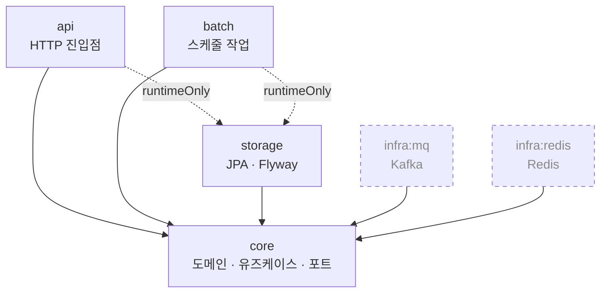

# coupon-yaho

선착순 쿠폰 발급 시스템

## 패키지 구조

### 모듈 의존 관계



실선은 `implementation`, 점선 화살표는 `runtimeOnly`, 점선 테두리는 아직 연결되지 않은 모듈이다.

| 모듈 | 역할 |
|---|---|
| `api` | HTTP 진입점. 요청/응답 변환, 전역 예외 처리 |
| `batch` | 스케줄 작업 (쿠폰 만료·정산 등) |
| `core` | 도메인 모델, 유즈케이스, 포트 인터페이스 |
| `storage` | JPA 어댑터, Flyway 마이그레이션 |
| `infra:mq` | Kafka 프로듀서·컨슈머 어댑터 |
| `infra:redis` | Redis 어댑터 (재고 카운터 등) |

`api`와 `batch`는 어댑터(`storage`, `infra:*`)를 **`runtimeOnly`로만** 의존한다.
컴파일 시점에 `JpaRepository`나 `KafkaTemplate`을 직접 참조하지 못하게 막아,
`core`가 정의한 포트 인터페이스만 사용하도록 강제하기 위함이다.

### 디렉터리

```
coupon-yaho
├── api                                  HTTP 진입점
│   └── src/main/java/com/kafkick
│       ├── ApiApplication.java          스캔·자동설정 기준 패키지라 한 단계 위에 둠
│       └── api/support/                 응답 봉투, 전역 예외 처리, requestId 필터
│
├── batch                                스케줄 작업
│   └── src/main/java/com/kafkick
│       └── BatchApplication.java
│
├── core                                 도메인 + 유즈케이스
│   └── src/main/java/com/kafkick/core
│       ├── coupon/                      도메인별 묶음
│       │   ├── domain/                  도메인 모델
│       │   ├── service/                 유즈케이스
│       │   └── port/                    어댑터가 구현할 인터페이스
│       └── support/                     TimeProvider(UTC), ErrorCode, BusinessException
│
├── storage                              JPA 어댑터
│   ├── src/main/java/com/kafkick/storage/db
│   │   ├── coupon/                      도메인별 묶음
│   │   │   ├── entity/                  JPA 엔티티
│   │   │   ├── repository/              JpaRepository + core port 구현체
│   │   │   └── mapper/                  엔티티 ↔ 도메인 모델 변환
│   │   ├── support/                     BaseEntity, UpdatableEntity
│   │   └── config/                      JPA Auditing
│   ├── src/main/resources
│   │   ├── storage.yml.example          DataSource·JPA·Flyway 공통 설정
│   │   └── db/migration/                Flyway DDL (V1__*.sql)
│   └── src/testFixtures/java/…/db       테스트 컨테이너 설정, @RepositoryTest
│
├── infra
│   ├── mq                               Kafka 어댑터 (토픽·프로듀서 설정 계층)
│   └── redis                            Redis 어댑터
│
└── build.gradle, settings.gradle
```

### 설정 파일

`application.yml`, `storage.yml`, `redis.yml`, `kafka.yml` 등 실행용 설정은 커밋하지 않는다.
`spring.config.import`는 optional이 아니라서 파일 하나가 없으면 기동이 중단된다
(`redis.yml`·`kafka.yml`이 그렇다).

**Gradle 빌드·테스트는 이 복사를 알아서 한다.** 루트 `build.gradle`의 `processResources`가
빌드 산출물에서 빠진 이름을 `.example`로 채운다 — 신규 클론에서 `./gradlew build`가 아무 수동
단계 없이 통과한다. 소스 트리에는 쓰지 않으므로, 각자 만든 실제 파일이 있으면 그쪽이 이긴다.

앱을 Gradle 밖에서 띄우거나(IDE가 Gradle에 위임하지 않는 설정) 파일을 직접 고쳐 쓰려면
아래로 복사한다. **설정 파일이 늘어나는 브랜치를 받은 뒤에도 다시 돌린다.**

```bash
find . -path '*/src/main/resources/*.yml.example' \
  -exec sh -c '[ -e "${1%.example}" ] || cp "$1" "${1%.example}"' _ {} \;
```

⚠️ **없을 때만 복사한다.** 예전에는 무조건 덮어써서, 브랜치를 받고 이 명령을 다시 돌리면
로컬에서 고친 DB 접속 정보나 스위치가 조용히 사라졌다. 어떤 파일을 최신 `.example` 값으로
되돌리고 싶으면 그 파일을 지우고 다시 돌린다.

⚠️ 이 복사를 빼먹어도 앱은 **죽지 않고 설정 없이 뜬다.** `application.yml`이 없으면 그 안의
`spring.config.import`가 통째로 안 돌아서, 나머지 파일이 없다는 사실조차 드러나지 않는다.
그 상태의 증상은 조건부 빈이 사라지는 것뿐이라 원인을 찾기 어렵다 — 위 자동 복사를 둔 이유다.

⚠️ **위 명령은 모듈 리소스만 채운다.** compose 로 띄울 때 필요한 저장소 루트의 두 파일은
따로 복사해야 한다 — `compose.yml`이 `./application.yml`을 컨테이너에 bind mount 하고
`.env`를 `env_file`로 읽는다. 둘 다 gitignore 대상이라 신규 클론에는 없다.

```bash
[ -e .env ] || cp .env.example .env
[ -e application.yml ] || cp application.yml.example application.yml
```

빼먹고 `docker compose up` 하면 Docker가 `application.yml`이라는 **디렉터리**를 만들어
마운트한다(실측). 설정이 통째로 비는데 에러에는 그 원인이 안 나온다.

DB 접속 정보는 파일에 적지 않고 `DB_HOST`·`DB_NAME`·`DB_USERNAME`·`DB_PASSWORD`
환경변수로 주입한다. `.example`의 값은 로컬 개발용 기본값이다.

### API 모니터링

API Actuator는 애플리케이션 포트와 분리된 관리 포트(기본 `9090`)에서만 노출한다.
노출 엔드포인트는 `health`, `metrics`, `prometheus`이며 `env`, `configprops`,
`beans`, `heapdump`는 명시적으로 차단한다.

```bash
curl http://localhost:9090/actuator/health
curl http://localhost:9090/actuator/metrics/coupon.issue.operation.requests
curl http://localhost:9090/actuator/metrics/coupon.issue.operation.duration
curl http://localhost:9090/actuator/metrics/hikaricp.connections.active
curl http://localhost:9090/actuator/metrics/http.server.requests
```

쿠폰 발급 시작·종료 과정 로그는 `COUPON_ISSUE_LOG_LEVEL=TRACE`일 때만 출력한다.
부하 테스트에서는 로그 I/O가 측정값을 오염시키지 않도록 기본값 `INFO`를 유지한다.
커스텀 `operation` 지표는 서버 내부 유즈케이스 시간을 뜻하며, 최종 성능 판정 기준은
Locust가 클라이언트 응답 수신 시점에 측정한 값이다.

API와 배치를 로컬에서 동시에 실행해 `9090` 포트가 겹치면 API에
`MANAGEMENT_SERVER_PORT=19090`을 지정한다.

### Docker 이미지

`main` 브랜치 push 또는 `v*` 태그 push 시 GitHub Actions가 API와 배치 이미지를
각각 빌드해 하나의 Docker Hub 저장소에 태그를 구분하여 올린다. 수동 실행도 가능하다.

- 주소: `https://hub.docker.com/r/${DOCKERHUB_USERNAME}/coupon-yaho`
- API 이미지: `${DOCKERHUB_USERNAME}/coupon-yaho:api-latest`
- 배치 이미지: `${DOCKERHUB_USERNAME}/coupon-yaho:batch-latest`

GitHub 저장소의 **Settings → Secrets and variables → Actions**에 아래 값을 등록한다.

- Variable `DOCKERHUB_USERNAME`: Docker Hub 사용자명 또는 조직명
- Secret `DOCKERHUB_TOKEN`: Docker Hub의 read/write 권한 Personal access token

Docker Hub에는 `coupon-yaho` 저장소를 한 번 생성해야 한다.

로컬 빌드는 다음과 같다.

```bash
docker build --build-arg APP_MODULE=api -t coupon-yaho-api .
docker build --build-arg APP_MODULE=batch -t coupon-yaho-batch .
```

테스트는 Testcontainers 로 실제 MySQL 을 띄우므로 Docker 가 필요하다.

### 신규 환경의 런타임 설정 초기화

`config:runtime`은 애플리케이션이 자동으로 만들지 않는다. 신규 Redis 볼륨을 준비한
환경에서는 API를 올리기 전에 Redis를 기동하고 다음 시드 작업을 명시적으로 한 번
실행한다.

```bash
docker compose up -d redis
docker compose --profile runtime-config-seed run --rm runtime-config-seed
docker compose up -d
```

시드 작업은 `SET NX`를 사용하므로 이미 존재하는 설정과 revision을 덮어쓰지 않는다.
이 절차는 **새 환경의 최초 초기화 전용**이다. 운영 중 키 유실이나 데이터 복구 상황에서
revision을 0으로 되돌리는 복구 수단으로 사용하지 않는다.

### 기존 MySQL 볼륨에 관측 계정 추가

관측 전용 계정(`DB_OBS_USERNAME`)은 compose 가 자동으로 만든다 —
`infra/mysql/initdb/20-obs-account.sh` 가 그 자리다.

**다만 `initdb.d` 는 데이터 디렉터리가 비어 있을 때만 돈다.** 이미
`coupon-mysql-data` 볼륨이 있는 환경에서는 그 파일을 고쳐도 아무 일이 일어나지 않고,
관측 조회가 첫 요청에서 `Access denied` 로 죽는다. 기존 볼륨을 쓰는 사람에게는
재현이 안 되므로 *"내 로컬은 되는데"* 가 되기 쉬운 자리다.

그때는 **초기화 스크립트를 그대로 한 번 돌린다.** SQL 을 손으로 옮겨 적지 않는다 —
그 스크립트가 식별자 검증·따옴표와 백슬래시 이스케이프·`ALTER USER`(비밀번호 회전)를
전부 갖고 있고, 손으로 적은 명령은 그것을 잃는다.

```bash
# 1) 컨테이너를 다시 만든다. 데이터 볼륨은 유지된다
docker compose up -d mysql

# 2) STATUS 가 healthy 가 될 때까지 기다린다
docker compose ps mysql

# 3) 스크립트를 한 번 돌린다
docker compose exec mysql sh /docker-entrypoint-initdb.d/20-obs-account.sh
```

⚠️ **1번을 건너뛰면 3번이 실패한다.** `docker compose exec` 는 컨테이너를 다시 만들지
않으므로, 이 변경 **이전에 만들어진 컨테이너에는 그 스크립트가 마운트돼 있지 않다.**
실제로 확인하면 이렇다.

```
$ docker compose exec -T mysql ls -l /docker-entrypoint-initdb.d/
total 0
```

`up -d` 는 데이터 볼륨(`coupon-mysql-data`)을 그대로 두고 컨테이너만 새 정의로 바꾼다.
데이터 디렉터리가 비어 있지 않으므로 `initdb.d` 는 여전히 자동 실행되지 않는다 —
그래서 3번을 손으로 돌리는 것이다.

값을 셸에 올릴 필요는 없다. `compose.yml` 의 mysql 서비스가 `env_file: .env` 로
`DB_OBS_USERNAME` · `DB_OBS_PASSWORD` · `MYSQL_*` 를 갖고 있고, 다시 만든 컨테이너가
그 값과 마운트를 함께 받는다.

> ⚠️ **`. ./.env` 로 소싱하지 말 것.** 그러면 값 안의 `$(...)` 가 호스트 셸에서 실행된다.
> 비밀번호 관리 도구가 만든 값에 그런 문자가 들어갈 수 있다.

몇 번을 돌려도 같은 결과다 — `CREATE USER IF NOT EXISTS` 뒤에 `ALTER USER` 가 붙어 있어
비밀번호도 매번 맞춰진다.

**GRANT 는 스키마 단위여야 한다.** 테이블 단위로 열거하면 새 테이블이 생길 때마다 조용히
빠진다 — 배치 이력 조회가 읽는 `BATCH_JOB_EXECUTION` · `BATCH_JOB_INSTANCE` 는 Spring Batch 가
만든 것이라 목록에서 누락되기 가장 쉽다. compose 초기화 경로에서는 애초에 테이블 단위가
불가능하다(그 시점엔 Flyway 가 안 돌아 테이블이 없어서 `ERROR 1146` 으로 컨테이너가 안 뜬다).

### 새 코드를 어디에 둘 것인가

쿠폰 발급 기능을 예로 들면:

```
core/coupon/
    domain/     CouponRound, Issuance        발급 쿠폰 도메인 모델
    service/    CouponIssueService           유즈케이스
    port/       IssuanceRepository           인터페이스만. 구현은 어댑터가

core/coupontemplate/
    domain/     CouponTemplate               쿠폰 템플릿 도메인 모델
    service/    CouponTemplateCreateService  템플릿 유즈케이스
    port/       CouponTemplateRepository     템플릿 저장 인터페이스

storage/db/coupon/
    entity/     IssuanceEntity
    repository/ IssuanceJpaRepository
                IssuanceRepositoryImpl       core 의 port 구현
    mapper/     IssuanceEntityMapper         엔티티 ↔ 도메인 모델 변환

storage/db/coupontemplate/
    entity/     CouponTemplateEntity
    repository/ CouponTemplateJpaRepository
                CouponTemplateRepositoryImpl core 의 port 구현
    mapper/     CouponTemplateEntityMapper   엔티티 ↔ 도메인 모델 변환

infra/mq/coupon/
    CouponEventPublisher                     core 의 port 구현

api/coupon/
    controller/  CouponController
    dto/request/ CouponUseRequest
    dto/response/CouponIssueResponse

api/coupontemplate/
    controller/  CouponTemplateController
    dto/request/ CouponTemplateCreateRequest
    dto/response/CouponTemplateDetailResponse
```

각 모듈의 `support/` 패키지는 그 모듈 안의 횡단 관심사를 담는다.
