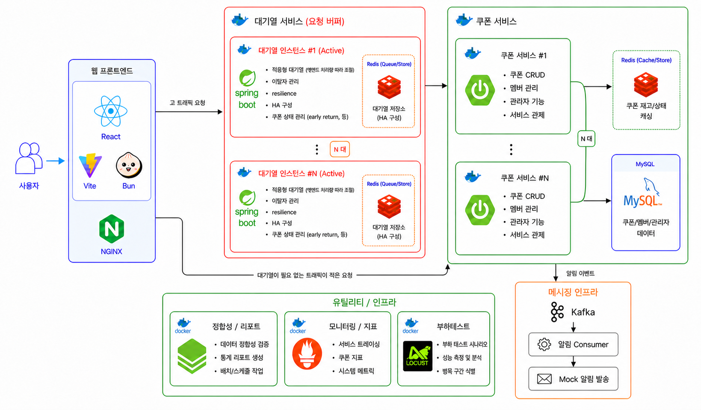
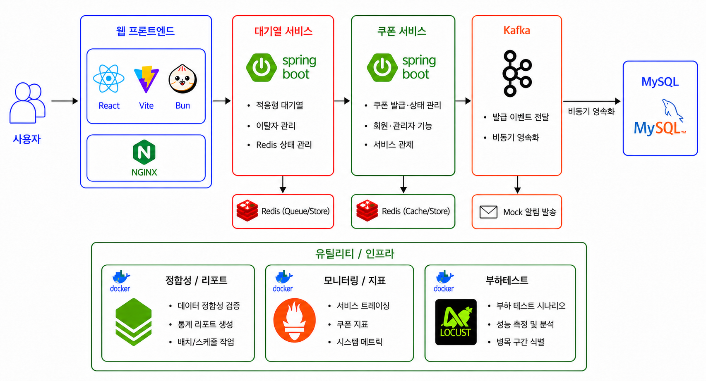
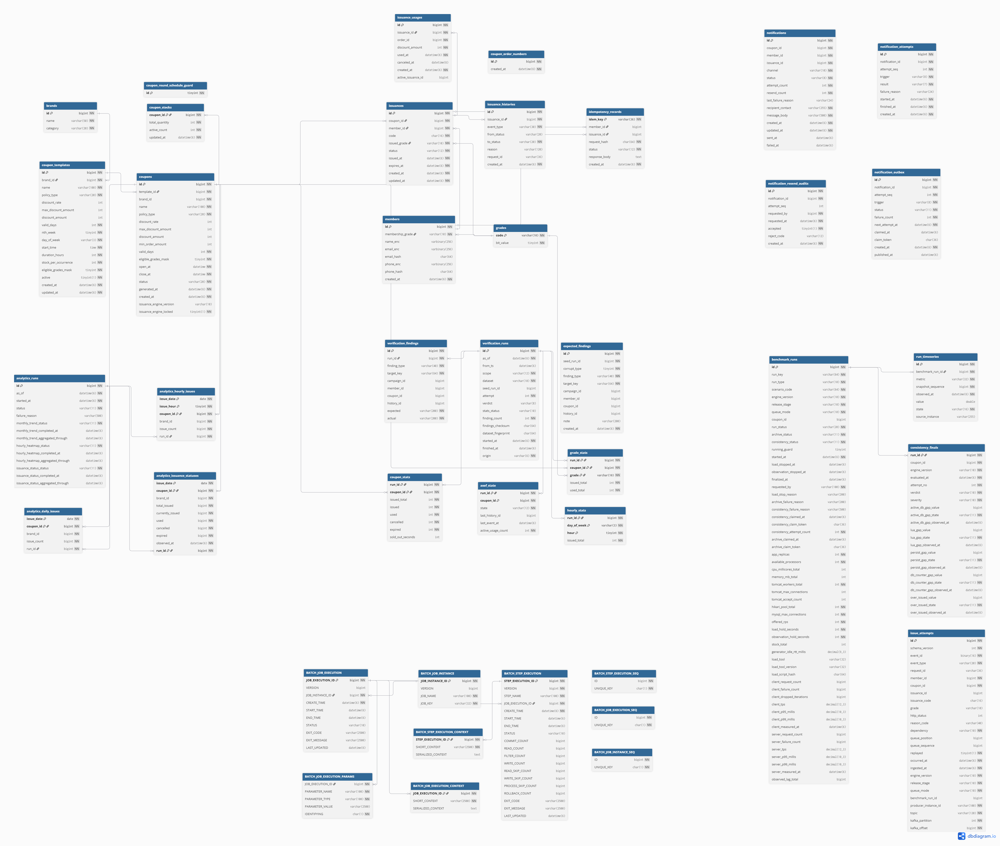

# 쿠폰 야호~

> 트래픽이 한순간에 몰리는 브랜드데이에서 한정 수량 쿠폰을 정확하게 발급하고,
> 그 결과를 데이터와 지표로 검증하는 선착순 쿠폰 플랫폼입니다.

## 1. 프로젝트 소개

쿠폰 야호~는 정해진 시각에 한정 수량 쿠폰을 공개하고, 많은 사용자가 동시에 요청해도
재고를 초과하거나 한 사람이 중복 발급받지 않도록 설계한 시스템입니다.
단순히 요청을 빠르게 처리하는 데서 끝나지 않고, 병목이 발생한 위치를 측정한 뒤
DB 락, 원자 갱신, Redis 선점, 적응형 대기열 순서로 구조를 발전시켰습니다.
발급 이후에는 이력을 다시 계산하는 검증 배치와 운영 지표를 통해 결과가 실제로
정확한지 확인합니다.

### 핵심 목표

- **정확한 발급** — 재고 초과 발급 0건, 회차별 1인 1매
- **유입 보호** — 시스템 가용량에 맞춰 대기열 입장량 조절
- **장애 회복** — Redis 선점 실패 보상, 재구성, 멱등 재처리
- **검증 가능성** — 발급 이력을 다시 계산해 저장 상태와 교차 검증
- **운영 가시성** — 발급 결과, 지연, 재고, 배치 상태를 지표와 관리자 API로 제공

### 프로젝트 범위

이 문서는 프론트엔드를 제외하고 쿠폰 백엔드, 적응형 대기열 게이트웨이,
대용량 시드 데이터 생성기와 검증 배치를 중심으로 설명합니다.

## 2. 구조의 발전 과정

쿠폰 야호~는 처음부터 모든 인프라를 도입하지 않았습니다. 같은 재고와 요청 조건에서
현재 구조의 병목을 확인하고, 그 구조로 해결할 수 없는 한계가 드러났을 때 다음 단계로
확장했습니다.


| 버전   | 상태        | 핵심 방식                                 | 해결한 문제                              | 남은 한계                         |
| ---- | --------- | ------------------------------------- | ----------------------------------- | ----------------------------- |
| v1.1 | 구현·측정 기준선 | MySQL 비관적 락 (`SELECT ... FOR UPDATE`) | 동시 발급 시 재고 정합성 보장                   | 단일 재고 행에서 요청 직렬화, 락 대기 증가     |
| v1.2 | 구현        | 조건부 원자 `UPDATE`                       | 조회와 갱신을 한 문장으로 줄여 락 보유 구간과 DB 왕복 축소 | 단일 재고 행 경합과 요청별 동기 DB 트랜잭션 유지 |
| v2.1 | 구현        | Redis Lua 원자 재고 선점                    | 재고 판정과 차감을 Redis로 옮겨 DB 재고 경합 완화    | 순간 유입과 발급 성공 건별 DB 영속화 유지     |
| v2.2 | 핵심 경로 구현  | 적응형 대기열 게이트웨이                         | 평시 요청은 즉시 통과시키고, 혼잡 시 가용량에 맞춰 유입 제어 | 요청별 동기 DB 커밋의 처리량 한계 유지       |
| v3   | **설계**    | Kafka 기반 비동기 발급 이벤트                   | 요청 처리와 DB 영속화를 분리하고 배치 저장하는 방향 설계   | 발급 엔진의 구현·성능 검증은 진행하지 않음      |


### 전환 흐름

```text
v1.1  정확성 확보
      └─ 비관적 락 대기와 커넥션 점유
          ↓
v1.2  조건부 원자 UPDATE
      └─ 락 구간은 줄었지만 단일 재고 행과 동기 DB 처리 유지
          ↓
v2.1  Redis Lua 재고 선점
      └─ DB 재고 경합은 줄었지만 순간 유입과 건별 영속화 유지
          ↓
v2.2  적응형 대기열
      └─ 유입은 제어하지만 성공 요청마다 DB 커밋 필요
          ↓
v3    Kafka 비동기 영속화 구조 설계
```

버전별 비교는 재고 10,000장, 요청 20,000건, 같은 초기 데이터와 같은 부하 스크립트를
사용하는 것을 원칙으로 합니다. 한 번의 결과로 결론을 내리지 않고 동일 조건을 반복한 뒤
중앙값을 비교하며, 성공 응답과 매진 응답의 지연 분포를 분리합니다.
부하 발생과 응답시간 측정에는 **Locust**를 사용했습니다.

## 3. 시스템 아키텍처

### v1 — MySQL 중심 동기 발급


쿠폰 서비스가 MySQL에서 발급과 재고를 동기적으로 처리하는 구조입니다.
정합성은 보장하지만 요청이 몰리면 단일 재고 행의 경합과 DB 커넥션 점유가 병목이 됩니다.

### v2 — Redis 선점과 적응형 대기열



대기열 서비스가 백엔드 가용량에 맞춰 유입을 조절하고, 쿠폰 서비스는 Redis에서 재고를
원자적으로 선점합니다. MySQL은 발급 이력과 최종 데이터를 보관하며 Kafka는 알림 이벤트
전달에 사용합니다.

### v3 — Kafka 비동기 영속화 설계안



발급 요청 처리와 MySQL 영속화를 Kafka로 분리하는 목표 구조입니다.
**v3는 구현 결과가 아니라 설계까지만 진행한 아키텍처입니다.**

### 요청 흐름과 컴포넌트 책임

1. 대기열 게이트웨이는 쿠폰 요청을 받아 현재 모드와 백엔드 가용량을 기준으로 즉시 통과,
기, 거절을 판정합니다. 게이트웨이는 입장만 책임지고 발급이나 재고 차감은 수행하지 않습니다.
2. 통과한 발급 요청은 쿠폰 API에서 멱등키와 사용자·등급 요청값을 검증한 뒤 도메인 서비스로
달됩니다.
3. v1 계열은 MySQL의 조건부 재고 갱신을 최종 방어선으로 사용합니다. v2.1은 Redis Lua로
고를 먼저 선점하고, DB 영속화 실패 시 요청 토큰을 확인해 Redis 선점을 보상합니다.
4. MySQL은 회차, 재고, 발급, 상태 이력, 사용 실적과 멱등 응답을 보관합니다.
edis는 v2 재고와 발급 게이트, 런타임 설정 및 캐시 상태를 담당합니다.
5. 배치 애플리케이션은 만료·정리·검증·통계를 발급 API와 분리해 수행합니다.
측용 읽기는 별도 DataSource와 양성 목록 권한을 사용해 운영 쿼리와 격리합니다.
6. Prometheus는 API·배치·대기열의 지표를 수집하고, 관리자 API는 운영 현황·성능 회차·검증
과를 조회할 수 있는 백엔드 계약을 제공합니다.
7. v3는 발급 결과를 Kafka 이벤트로 전달해 요청 처리와 DB 영속화를 분리하는 방향까지
계했습니다. 현재 발급 엔진의 구현·부하 검증 결과로 설명하지 않습니다.

## 4. 핵심 기능

### 사용자 기능

- 브랜드데이·캘린더·공개 쿠폰 회차 조회
- 발급 가능한 쿠폰 목록과 상세 조회
- 등급 및 회차 상태를 반영한 선착순 쿠폰 발급
- 보유 쿠폰 조회, 사용, 사용 취소, 발급 취소
- 대기열 진입, 순번·예상 대기시간 확인, 입장 토큰 발급

### 관리자 기능

- 쿠폰 템플릿 생성·조회·활성 상태 변경
- 쿠폰 회차 생성, 목록 조회, 상태 전이
- 회원별 발급 조회와 발급 이력 조회
- 쿠폰 지표, 분석 데이터 조회
- 검증 실행·진행률·이력 조회
- 배치 실행 이력과 중단된 만료·정리 작업 복구
- 관측 지표·이벤트·알림 실패 및 재전송 상태 조회

## 5. 핵심 기술 설계

### 동시성 제어와 재고 정합성

재고는 누적 발급량이 아니라 현재 활성 상태인 `ISSUED + USED` 수량인
`active_count`로 관리합니다. 잔여 재고는 `total_quantity - active_count`입니다.

- **v1.1** — 재고 행을 비관적 락으로 잠가 동시에 한 요청만 재고를 변경
- **v1.2** — `active_count < total_quantity` 조건을 가진 원자 `UPDATE`의 변경 행 수로
발급 성공 여부 판정
- **v2.1** — Redis Lua가 재고·회원 발급 여부·멱등 요청 토큰을 한 번에 판정하고 선점
- **DB 최종 방어선** — `UNIQUE(coupon_id, member_id)`로 회차별 1인 1매를 물리적으로 보장
- **검증 방어선** — 이력을 상태 머신으로 다시 접어 현재 상태와 재고 카운터를 교차 검증

### 적응형 대기열

대기열은 쿠폰 백엔드와 분리된 WebFlux 기반 게이트웨이로 구현했습니다.

- 평시 또는 대기열 OFF 모드에서는 불필요한 대기 없이 백엔드로 통과
- 혼잡 시 대기열에 등록하고 전역 순번과 ETA 제공
- 백엔드 인스턴스의 가용량을 수집해 입장 허용량 계산
- Redis 리더 선출과 임대 시간으로 제어 평면의 단일 결정권 유지
- 이탈자 정리, 입장 토큰, 재진입 유예, 매진 회차 정리
- 순번 역행과 기존 대기자 추월을 금지하는 공정성 불변식 유지

현재 저장소 문서 기준으로 입장 판정부터 큐 생명주기까지의 핵심 단계는 닫혔고,
장애 회복력과 규모 확장 검증은 별도 단계로 관리합니다.

### 멱등성과 실패 복구

- `Idempotency-Key`는 UUID v4 형식을 검증합니다.
- 같은 키와 같은 요청은 저장된 결과를 재사용하고, 같은 키의 다른 요청은 거절합니다.
- 진행 중 레코드는 `IN_PROGRESS`, 완료 응답은 `DONE`으로 구분합니다.
- v2 발급은 Redis 선점 → DB 저장 순서로 수행합니다.
- DB 저장 실패 시 선점 당시의 요청 토큰과 일치하는 경우에만 Redis 재고를 보상합니다.
- Redis 상태가 유실되거나 불일치하면 DB 상태를 기준으로 회차 재고를 재구성합니다.
- 사용·취소·만료도 조건부 상태 전이와 저장된 이력을 함께 남겨 재시도 결과를 판정합니다.

### 검증 배치

검증 배치는 런타임과 같은 `CouponStateMachine`을 사용해 발급 이력을 순서대로 재생합니다.
다만 현재 상태를 그대로 믿지 않고, 재생 결과·재고 카운터·사용 실적을 서로 대조합니다.

검증기가 실제로 오류를 찾는지도 별도로 검증합니다. 시드 생성기는 다음 두 데이터셋을 만듭니다.


| 데이터셋    | 규모와 합격 기준                                                  |
| ------- | ---------------------------------------------------------- |
| CLEAN   | 회원 1,000,000명, 발급 3,000,000건, 이력 5,340,000건에서 검출 0건        |
| CORRUPT | 의도적으로 주입한 700건이 800개의 기대 finding을 만들며, 검출 800건·누락 0건·오탐 0건 |


단순히 검출 개수만 비교하지 않고 `(finding_type, target_key)` 집합과 체크섬을 비교합니다.
생성·적재·자가 검증 결과는 시드 데이터 생성기의 실행 로그와 결과 이미지로 보존합니다.

### 관측과 운영

- 발급 결과를 성공·정상 거절·시스템 실패로 분리한 카운터
- API 전체 지연과 발급 유즈케이스 내부 지연을 분리한 타이머
- Redis 명령 지연, 회로 차단기 상태, 재고·대기열·배치 상태 지표
- HTTP 업무 포트와 Actuator 관리 포트 분리
- API와 배치의 관측용 DB 풀 분리
- 양성 목록 테이블만 읽는 관측 전용 MySQL 계정
- 벤치마크 조건, 서버 시계열, 클라이언트 결과, 최종 정합성 판정을 한 회차로 보존
- Alertmanager 알림과 관리자 관제 API를 통한 장애 원인 추적

### v3 Kafka 설계

v3의 목표는 HTTP 요청이 모든 DB 쓰기를 기다리는 구조를 바꾸는 것입니다.

```text
발급 요청
  → 재고·중복 판정
  → 발급 이벤트 Kafka 발행
  → 파티션 순서를 유지한 소비
  → 여러 결과를 묶어 MySQL 저장
  → 소비 지연과 실패를 지표·재처리 대상으로 관리
```

현재 `infra:mq`에는 Kafka 토픽·프로듀서·컨슈머 기반과 알림·관측 이벤트 경로가 존재하지만,
이를 v3 비동기 발급 엔진의 완료 또는 성능 검증 결과로 간주하지 않습니다.
**발급 이벤트의 end-to-end 비동기 영속화는 설계 범위이며, v3는 설계까지만 진행했습니다.**

## 6. ERD



- `coupons`는 발급 회차이며 `coupon_stocks`와 1:1로 재고를 관리합니다.
- `issuances`는 회원과 회차를 연결하며 회차별 회원 유일 제약이 1인 1매의 최종 방어선입니다.
- 상태 변화는 `issuance_histories`, 사용과 사용 취소는 `issuance_usages`에 보존합니다.
- `idempotency_records`는 요청 해시, 처리 상태, 저장 응답을 통해 재시도 결과를 보장합니다.
- `verification_runs`와 findings·통계 테이블은 검증 실행 단위와 결과를 재현 가능하게 보존합니다.

## 7. 패키지·모듈 구조

```text
cy-be
├── api          # HTTP 진입점, 요청·응답 변환, 관리자·관측 API
├── batch        # 만료·정리·검증·통계 배치와 관리용 트리거
├── core         # 도메인 모델, 상태 머신, 유즈케이스, 포트 인터페이스
├── storage      # MySQL JPA/JDBC 어댑터, Flyway 마이그레이션
├── infra
│   ├── redis    # Redis 재고 선점, 런타임 상태, 캐시, 회로 차단기
│   └── mq       # Kafka 토픽·프로듀서·컨슈머 어댑터
└── perf         # 부하 측정 환경 점검, 결과 수집·요약
```

`core`가 비즈니스 규칙과 포트를 정의하고 `storage`, `infra:*`가 이를 구현합니다.
`api`와 `batch`는 인프라 모듈을 `runtimeOnly`로 연결하므로 컴파일 시점에는 구체 어댑터 대신
`core`의 포트만 참조합니다. 검증·만료처럼 대용량 집계가 필요한 경로는 JPA 객체 그래프 대신
JDBC와 집계 SQL을 사용합니다.

## 8. 테스트와 검증


| 검증 대상     | 확인 내용                                      | 근거                                                                                                                           |
| --------- | ------------------------------------------ | ---------------------------------------------------------------------------------------------------------------------------- |
| 동시 발급     | 실제 MySQL에서 재고 초과 발급과 회차별 중복 발급 차단          | [`CouponIssueRepositoryTest`](storage/src/test/java/com/kafkick/storage/db/coupon/repository/CouponIssueRepositoryTest.java) |
| Redis 원자성 | Lua 선점·완료·보상 코드와 요청 토큰 소유권                 | [`infra/redis`](infra/redis/src/test) 테스트                                                                                    |
| 버전별 성능    | 같은 Locust 시나리오, 같은 초기 데이터, 반복 측정, 성공·매진 분리 | Locust 실행 결과 파일                                                                                                              |
| 대기열 공정성   | 순번 역행·추월 금지, 입장량 제어, 큐 생명주기                | 대기열 자동 판정 테스트                                                                                                                |
| 정합성 검증    | CLEAN 0건, CORRUPT 기대 집합과 검출 집합 일치          | 시드 생성·자가 검증 결과                                                                                                               |
| 배치 복구     | 중단 실행 탐지, stop·abandon·recover 상태 전이       | [`batch`](batch/src/test) 테스트                                                                                                |
| 운영 관측     | Prometheus 이름·라벨·알림 규칙과 실제 scrape 계약       | [`docs/14-observability-wiring.md`](docs/14-observability-wiring.md)                                                         |
| DB 권한     | 관측 계정이 양성 목록 테이블만 읽고 업무 테이블을 거부            | [`infra/mysql/obs-grants`](infra/mysql/obs-grants) 및 컨테이너 테스트                                                                |


성능 표에는 Locust 원본 결과, 테스트 환경, 초기 재고, 요청 수와 사후 재고 상태가 함께
남은 회차만 사용합니다. 설정한 부하와 실제 처리량을 구분하고, 부하 생성기나 네트워크가
병목인 회차는 서버 성능 근거에서 제외합니다.

## 9. 기술 스택


| 구분             | 기술과 사용 범위                                                          |
| -------------- | ------------------------------------------------------------------ |
| Language       | Java 21, Python 3.9+                                               |
| Backend        | Spring Boot 4.1.0, Spring MVC, Spring Batch, Spring Data JPA, JDBC |
| Queue Gateway  | Spring WebFlux, Spring Cloud Gateway                               |
| Database       | MySQL 8.4, Flyway                                                  |
| Cache / State  | Redis 7.4, Lua, Caffeine, Resilience4j                             |
| Messaging      | Kafka 4.1.0 — 알림·관측 인프라, v3 발급 엔진은 설계 범위                           |
| Monitoring     | Spring Boot Actuator, Micrometer, Prometheus 3.6, Alertmanager     |
| Test           | JUnit 5, AssertJ, Testcontainers, Locust                           |
| Infrastructure | Docker, Docker Compose, NGINX, GitHub Actions                      |


## 10. 팀 구성과 역할


| 팀원  | 담당 영역     | 주요 기여                     |
| --- | --------- | ------------------------- |
| 허건  | 배치·검증·스키마 | 시드 생성기, 정합성 검증, DB 마이그레이션 |
| 유희준 | 대기열 게이트웨이 | 입장 판정, 전역 순번, 리더 선출       |
| 설승환 | 관측·인프라    | 관측 이벤트, Redis, 벤치마크 환경    |
| 이경주 | 관리자·관제    | 관리자 API, 관제 백엔드, 알림 계약    |
| 박지훈 | 쿠폰 도메인    | 쿠폰·회차, 발급 API, 재고 차감      |
