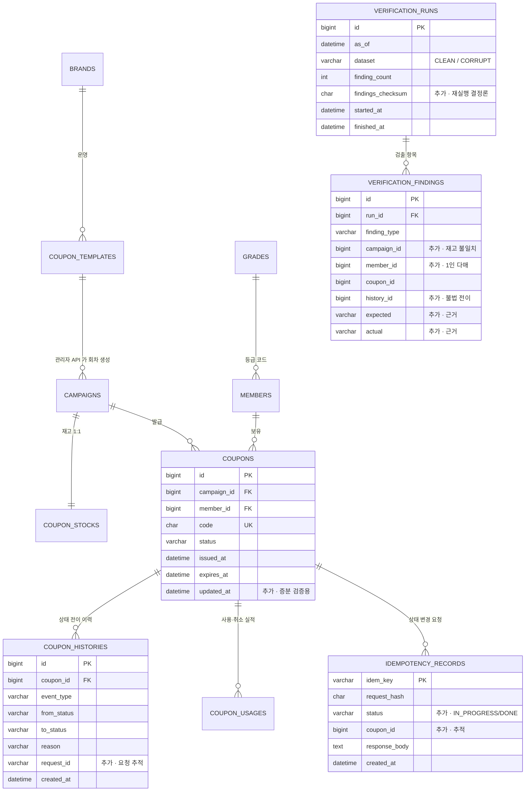

# ERD — 이대로 가는 것과 손볼 것

> 입력: `PRD-v4.15.md` 데이터 모델 탭
> 도메인 테이블은 잘 잡혀 있다. 손볼 곳은 **검증 3테이블**과 **대조축 하나**다.

---

> ### ⚠️ 어휘 — DDL 명칭이 정답이다
>
> | 지금 이름 | 뜻 | 이 문서의 구 어휘 |
> |---|---|---|
> | `coupons` | **회차** 147 | `campaigns` |
> | `issuances` | **발급건** 300만 | `coupons` |
> | `issuance_histories` | 이력 534만 | `coupon_histories` |
> | `issuance_usages` | 사용 실적 132만 | `coupon_usages` |
>
> 컬럼명만 레거시로 남은 것 — `verification_findings.campaign_id` → `coupons.id`,
> `.coupon_id` → `issuances.id`, `asof_state.coupon_id` → `issuances.id`.
> 본문에 구 어휘가 남아 있으면 위 표로 치환해 읽는다.

---

## 먼저, 이 ERD의 좋은 판단 5개

일정이 밀리면 "간단하게 합치자"는 말이 나오는데, 아래는 합치면 프로젝트가 망가진다.

### 1. `coupon_stocks`를 캠페인에서 1:1로 뗀 것

```
campaigns(id, template_id, ..., open_at, close_at, status)
coupon_stocks(campaign_id PK, total_quantity, active_count)
```

**이게 이 ERD에서 제일 잘한 판단이다.** 재고를 캠페인 행에 두면 조회(캠페인 정보)와 수정(재고 차감)이 같은 행에 몰려서 v1의 `SELECT FOR UPDATE`가 캠페인 전체를 잠근다. 별도 행이면 재고 행만 잠긴다.

v1이 "비관적 락으로 인한 병목"을 측정하는 버전인데, 잠금 범위가 필요 이상으로 넓으면 **측정하는 게 락 경합이 아니라 설계 실수**가 된다.

### 2. 템플릿 → 캠페인 스냅샷

반복 규칙(`nth_week`, `day_of_week`, `start_time`)은 템플릿에, 회차는 캠페인에. 그리고 정책 컬럼을 캠페인에 **복사**한다.

3월 캠페인이 20% 할인으로 열렸는데 4월에 템플릿을 15%로 바꾸면, 스냅샷이 없을 경우 3월 쿠폰의 할인율이 소급 변경되고 `coupon_usages.discount_amount`와 어긋나 정합성 검증이 깨진다. 이건 비정규화가 아니라 **시점 고정**이다.

### 3. `coupon_histories` append-only 분리

상태는 `coupons.status`에서 갱신되고, 이력은 추가만 된다. **둘을 대조하는 게 정합성 검증 그 자체다.** 이력에 UPDATE가 생기는 순간 검증할 대상이 사라진다.

### 4. `coupon_usages`를 이력과 따로 둔 것

이력은 "무슨 일이 일어났나"(상태 전이), usages는 "얼마를 할인했나"(실적). 성격이 다르다. 재사용 시 여러 행이 쌓이는 것도 자연스럽다.

### 5. `grades` 4행 참조 테이블 + 비트마스크

발급 경로는 JWT 클레임으로 DB를 안 타고, 검증 배치만 4행짜리 테이블을 조인해 `(mask & bit_value) = 0`으로 위반을 잡는다. **뜨거운 경로와 차가운 경로를 다르게 다룬 것**이 정확하다.

---

## 손볼 것 — 우선순위 순

### 🔴 F1. `verification_findings`가 쿠폰 단위만 표현한다

```
현재:  verification_findings { id PK, run_id FK, finding_type, coupon_id }
```

검증 규칙과 대조해 보면 **절반이 이 구조에 안 들어간다.**

| 검증 규칙 | 위반이 발생하는 단위 | `coupon_id`로 표현되나 |
|---|---|---|
| 재고 정합 (`active_count` ↔ 실제 집계) | **캠페인** | ❌ |
| 1인 1매 위반 | **(캠페인, 회원)** — 쿠폰 2장의 *쌍*이 문제 | ❌ |
| 이력 리플레이 불일치 | 쿠폰 | ✅ |
| 불법 전이 | **이력 행** — 어느 전이가 문제인지 | ❌ (쿠폰까지만) |
| 사용 실적 불일치 | 쿠폰 | ✅ |

오염셋 6유형 중 유형 6("동일 유저가 같은 캠페인에서 2건")은 **쿠폰 하나가 아니라 쌍**이다. `coupon_id` 하나만 적으면 나머지 한 장은 어디에 적나.

그리고 **`detail`이 없어서 리포트가 "쿠폰 812934가 이상함"까지만 말한다.** 뭐가 어떻게 이상한지(기대값 vs 실제값)를 못 쓴다. 검증 리포트 자동화가 선택사항이라도 이건 있어야 한다 — 우리가 개발 중에 제일 많이 볼 화면이니까.

**우리가 할 것** — 대상을 다형 키로 넓히고 근거를 남긴다.

```sql
verification_findings(
  id           BIGINT PK,
  run_id       BIGINT FK,
  finding_type VARCHAR(40),      -- STOCK_MISMATCH / DUP_PER_MEMBER / REPLAY_MISMATCH / ...
  campaign_id  BIGINT NULL,      -- 재고 불일치
  member_id    BIGINT NULL,      -- 1인 다매
  coupon_id    BIGINT NULL,      -- 쿠폰 단위
  history_id   BIGINT NULL,      -- 불법 전이
  expected     VARCHAR(200),     -- "active_count=9998"
  actual       VARCHAR(200),     -- "coupons 집계=10001"
  INDEX idx_run_type (run_id, finding_type)
)
```

**확정** — 다형 FK 컬럼은 조회 편의로만 남기고, **집합 비교·UNIQUE·checksum 은 `target_key` 문자열 하나로만** 한다.
형식은 `COUPON:{회차id}` / `COUPON:{회차id}|MEMBER:{회원id}` / `ISSUANCE:{발급건id}` / `HISTORY:{이력id}`.
FK 컬럼으로 직접 비교하면 `NULL = NULL` 이 UNKNOWN 이라 **정확히 검출한 finding 이 전부 누락으로 잡힌다.**
`expected`/`actual` 은 `NOT NULL` 로 둔다.

---

### 🔴 F2. `verification_runs`에 재실행 결정론을 판정할 컬럼이 없다

```
현재:  verification_runs { id PK, as_of, dataset, finding_count }
```

과제가 요구하는 건 **"같은 데이터 기준으로 재실행하면 같은 결과"**다. 이걸 어떻게 증명하나?

- `finding_count`가 같다 → 약하다. 다른 쿠폰이 걸려도 개수는 같을 수 있다
- PRD의 *"같은 as_of면 finding_type 집합이 동일"* → 여전히 약하다. **어떤 쿠폰이** 걸렸는지를 안 본다
- findings 전체를 두 run 간 비교 → 비싸고, 통합 테스트로 만들기 번거롭다

**우리가 할 것** — 체크섬 컬럼 하나 추가한다.

```sql
verification_runs(
  id BIGINT PK,
  as_of DATETIME(6),
  dataset VARCHAR(10),           -- CLEAN / CORRUPT
  finding_count INT,
  findings_checksum CHAR(64),    -- ★ SHA-256 of 정렬된 (finding_type, target_key) 리스트
  started_at DATETIME(6),
  finished_at DATETIME(6)
)
```

이러면 재실행 결정론 검증이 **한 줄**이 된다.

```java
assertThat(run2.findingsChecksum()).isEqualTo(run1.findingsChecksum());
```

컬럼 하나로 과제 요구사항 하나를 직접 증명하는 것이라, 투자 대비 회수가 이 문서에서 제일 좋다.

---

### 🟠 F3. `coupon_usages`가 검증 대조축에서 빠져 있다

PRD는 **coupons ↔ histories** 대조만 강조한다. 그런데 진실의 축이 하나 더 있다.

```
PRD 본문:  "현재 유효한 사용은 canceled_at IS NULL인 행이고,
            쿠폰당 최대 1개여야 합니다. 이것도 검증 대상입니다."
```

*"이것도 검증 대상"*이라고 써놓고 검증 규칙 목록에도, 오염 6유형에도 없다.

**세 축이 서로 맞아야 한다.**

```
coupons.status = 'USED'
  ↔ coupon_histories 리플레이 결과 = USED
  ↔ coupon_usages 에 canceled_at IS NULL 인 행이 정확히 1개
```

**우리가 할 것** — 검증 규칙과 오염 유형을 각각 하나씩 추가한다.

```
V5  사용 실적 정합
    status='USED'  → canceled_at IS NULL 행이 정확히 1개
    status≠'USED'  → canceled_at IS NULL 행이 0개
    쿠폰당 활성 사용 행 2개 이상 → 위반

오염 유형 7 (100건)
    status는 ISSUED 인데 canceled_at IS NULL 인 usages 행이 남아 있음
    → 사용취소가 usages 를 안 건드리고 status 만 되돌린 버그의 형태
```

오염셋이 600 → 700건이 되는데, **오염 유형이 늘어나는 건 검증이 강해진다는 뜻**이라 부담이 아니다. 인덱스 `idx_usage_coupon_active (coupon_id, canceled_at)`가 이미 있어서 검출 비용도 낮다.

---

### 🟠 F4. `coupon_histories`에 요청 추적 키가 없다

```
현재:  coupon_histories { id, coupon_id, event_type, from_status, to_status, reason, created_at }
```

`idempotency_records`와 **연결이 전혀 없다.** 멱등키로 처리된 요청이 어떤 이력을 남겼는지 추적할 수 없다.

리플레이 검증 자체는 `from_status`/`to_status` 연쇄로 돌아가니까 치명적이진 않다. 오염 유형 3(CANCEL_USE 2번 기록)도 *"직전 `to_status`와 이번 `from_status`가 불일치"*로 잡힌다.

문제는 **불일치를 찾은 다음이다.** "이 쿠폰의 이력이 어긋났다"까지는 아는데 "어느 요청이 그랬나"를 못 쓴다. 개발 중 디버깅에서 이 차이가 크다.

**우리가 할 것** — 컬럼 하나 추가. 비용 거의 0.

```sql
coupon_histories 에  request_id VARCHAR(36) NULL  추가
idempotency_records 에  coupon_id BIGINT NULL  추가   (양방향 추적)
```

`idempotency_records`는 어차피 함정 5(멱등 동시 요청) 때문에 `status` 컬럼을 추가해야 한다. **같이 손대는 김에 넣는다.**

```sql
idempotency_records(
  idem_key      VARCHAR(36) PK,
  request_hash  CHAR(64),
  status        VARCHAR(12),   -- IN_PROGRESS / DONE     ← 함정 5
  coupon_id     BIGINT NULL,   -- 추적                    ← F4
  response_body TEXT,
  created_at    DATETIME(6)
)
```

---

### 🟡 F5. 실제 소진 시각을 저장할 곳이 없다

```
campaigns { open_at, close_at, status }
campaign_stats { ..., sold_out_seconds }
```

상태머신은 `OPEN → CLOSED (재고 소진 또는 close_at)`이다. 재고 소진으로 닫히면 `close_at`은 예정값 그대로인가, 실제 마감 시각으로 갱신되나?

- 예정값을 유지하면 → 실제 소진 시각이 어디에도 없다
- 갱신하면 → "언제 닫힐 예정이었나"가 사라진다

`sold_out_seconds`를 계산하려면 소진 시각이 필요하다.

**우리가 할 것** — 둘 중 싼 쪽. 컬럼을 안 늘리는 쪽을 택한다.

```
sold_out_seconds = (해당 캠페인의 마지막 ISSUE 이력 created_at) − open_at
                   단, 완판된 캠페인만. 미달 캠페인은 NULL
```

검증 배치가 어차피 이력을 전수 스캔하므로 **같은 패스에서 공짜로 나온다.** `close_at`은 예정값으로 두고 건드리지 않는다.

다만 이걸 명시해두지 않으면 구현자가 `close_at`을 갱신해버리고, 그 순간 "캠페인이 예정보다 일찍 닫혔다"는 정보가 소실된다.

---

### 🟡 F6. 템플릿 재고와 과거 캠페인 재고가 다른 게 정상이다

```
coupon_templates.stock_per_occurrence   회차당 재고 (고정값)
coupon_stocks.total_quantity            실제 캠페인 재고
```

PRD 캠페인 구성: 과거 144개는 **"캠페인당 재고 18,000~34,000장"으로 흩뿌린다.** 그런데 템플릿의 `stock_per_occurrence`는 브랜드당 하나의 고정값이다.

→ 더미데이터는 스케줄러를 거치지 않고 직접 생성한다는 뜻이고, **템플릿 값과 과거 캠페인 재고가 불일치하는 게 정상**이다.

스냅샷 원칙상 캠페인이 진실이므로 설계는 맞다. 문제는 이걸 명시 안 하면 **검증 배치 짜는 사람이 "템플릿과 캠페인 재고 불일치"를 오염으로 잡을 수 있다는 것.**

**우리가 할 것** — 검증 규칙에 명시적으로 제외를 적는다.

```
✗ 검증하지 않음: coupon_templates.stock_per_occurrence ↔ coupon_stocks.total_quantity
   이유: 캠페인은 생성 시점 스냅샷. 템플릿은 이후 회차의 기본값일 뿐이다.
        더미데이터의 과거 캠페인은 의도적으로 재고를 흩뿌렸다.
```

---

### 🟢 F7. `coupons.updated_at` — 있으면 편하고 없어도 된다

현재 `coupons`는 `issued_at`, `expires_at`만 있고 **마지막 상태 변경 시각이 없다.**

이력이 진실이라는 설계 의도상 맞다. 다만 개발 중 검증 배치를 **수십 번 돌린다**고 PRD가 썼는데, 매번 300만 전수를 도는 것과 "직전 run 이후 바뀐 것만" 도는 것은 체감 차이가 크다.

**우리가 할 것** — 컬럼은 넣되 검증 로직은 전수로 간다.

```sql
coupons 에  updated_at DATETIME(6)  추가
```

과제가 "300만 전수"를 요구하므로 **최종 검증은 반드시 전수**다. `updated_at`은 개발 중 빠른 반복용이고, 제출·시연은 전수 모드로 돌린다. 두 모드가 같은 결과를 내는지도 확인해두면 그 자체가 좋은 테스트가 된다.

---

## 인덱스 — 그대로 간다

PRD의 4종을 검토했는데 규모 대비 적절하다.

```sql
idx_coupon_campaign_status  (campaign_id, status)      -- 재고 정합 검증
idx_coupon_status_expires   (status, expires_at)       -- 만료 배치
idx_history_coupon          (coupon_id, created_at)    -- 이력 리플레이
idx_usage_coupon_active     (coupon_id, canceled_at)   -- 사용 실적 검증 (F3)
uk_campaign_member          (campaign_id, member_id)   -- 제약 겸 인덱스. 1인 다매 검출 커버
```

추가로 검토했지만 **불필요하다고 판단한 것들**:

| 후보 | 판단 |
|---|---|
| `coupons(member_id)` | "내 쿠폰 목록" API가 없다. 대시보드도 캠페인 단위 |
| `campaigns(status)`, `campaigns(open_at)` | 147행. 풀스캔이 인덱스보다 빠르다 |
| `coupon_histories(created_at)` | 시계열은 애플리케이션 링버퍼. `hourly_stats`는 어차피 전수 스캔 |

**한 가지만 실행 순서로 지킨다** — 더미데이터 적재 시 **인덱스는 나중에 만든다.**

```
1. 인덱스·제약 없이 coupons 300만 · histories 520만 JDBC batch 적재
2. 적재 완료 후 CREATE INDEX + ADD CONSTRAINT
```

300만 행에 인덱스 3개를 걸어두고 INSERT하면 매 행마다 B-tree가 갱신된다. R4(적재 시간 초과, 조기 신호 "D4까지 적재가 안 끝남")의 가장 직접적인 대응이다.

---

## 손본 뒤의 ERD

관계선은 그대로다. 바뀐 건 **검증 3테이블과 컬럼 5개**뿐이다.



**나머지 테이블**(`BRANDS`, `COUPON_TEMPLATES`, `CAMPAIGNS`, `COUPON_STOCKS`, `MEMBERS`, `GRADES`, `COUPON_USAGES`, 집계 3종)은 **PRD 원안 그대로 간다.** 도메인 모델링은 손댈 게 없다.

---

## 정리 — 무엇이 왜 바뀌었나

바뀐 것이 전부 **검증 쪽**이라는 게 이 검토의 결론이다.

| # | 변경 | 이유 | 비용 |
|---|---|---|---|
| F1 | `verification_findings` 다형 키 + `expected`/`actual` | 검증 규칙 5개 중 3개가 쿠폰 단위가 아님 | 컬럼 5개 |
| F2 | `verification_runs.findings_checksum` | 재실행 결정론을 한 줄로 증명 | 컬럼 1개 |
| F3 | `coupon_usages` 대조축 + 검증 V5 + 오염 유형 7 | PRD가 "검증 대상"이라 써놓고 규칙에 없음 | 규칙 1개 |
| F4 | `coupon_histories.request_id`, `idempotency_records.coupon_id` | 불일치를 찾은 다음 원인 추적 | 컬럼 2개 |
| F5 | `sold_out_seconds`는 이력에서 계산, `close_at` 불변 | 실제 소진 시각 저장 위치 부재 | 컬럼 0개 |
| F6 | 템플릿↔캠페인 재고 불일치를 검증 제외로 명시 | 오탐 방지 | 문서 1줄 |
| F7 | `coupons.updated_at` | 개발 중 증분 검증. 최종은 전수 | 컬럼 1개 |

**도메인 모델은 그대로 간다.** `coupon_stocks` 분리, 스냅샷, append-only 이력, 비트마스크 — 전부 이유가 명확하고 우리가 더 나은 안을 못 낸다.

**검증 모델만 우리가 세운다.** PRD가 "검증 체계"를 이 프로젝트의 핵심이라고 규정해 놓고 정작 `verification_*` 두 테이블은 컬럼 4개씩으로 스케치만 해뒀다. 거기가 우리 몫이다.
